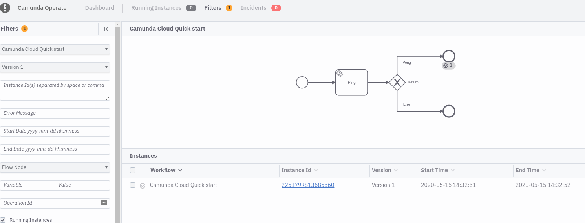
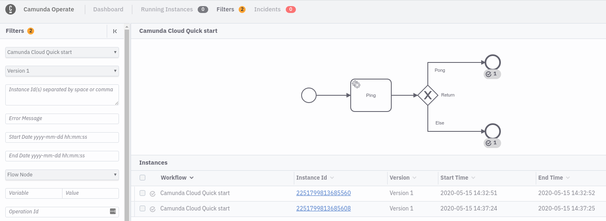

Prerequisite: [Quick Start](./gettingstarted_quick-start.md)

This tutorial shows you how to register a worker with `zbctl` and use it in your workflow.

## Install `zbctl`

`zbctl` is the command line tool that allows you to interact with a Zeebe Broker. Install `zbctl` via [npm](https://www.npmjs.com/package/zbctl):

```bash
npm i zbctl
```

Print the version to make sure that `zbctl` was installed:

```bash
zbctl version
```

In [Quick Start](./gettingstarted_quick-start.md) you have already created a cluster and a client. We will also use these for this tutorial.

## Advanced Workflow

[This workflow model](./assets/gettingstarted_quickstart_advanced.bpmn) is used for this tutorial. It contains a service task whose jobs are processed by the worker `test-worker`.


The worker will return a JSON object as a result, which is used to decide which path to take.

## Deploy workflow

Navigate to the client section of the cluster details. Use the button `Show connection info` to display all needed export statements for environment variables (Windows user: you can also use the [described flags](https://www.npmjs.com/package/zbctl#usage) `--address`, `--clientId` and `--clientSecret`).

Test the connection by printing out the topology:

```bash
zbctl status
```

As a result, you'll get a similar result:

```bash
Cluster size: 1
Partitions count: 1
Replication factor: 1
Gateway version: 0.23.1
Brokers:
  Broker 0 - zeebe-0.zeebe-broker-service.0e65413b-cc0d-4b9a-9bfb-7b30f81a739a-zeebe.svc.cluster.local:26501
    Version: 0.23.1
    Partition 1 : Leader
```

Now you can deploy the [workflow](./assets/gettingstarted_quickstart_advanced.bpmn).

```bash
zbctl deploy gettingstarted_quickstart_advanced.bpmn
```

If the deployment is successful you'll get the following output:

```bash
{
  "key": 2251799813685493,
  "workflows": [
    {
      "bpmnProcessId": "camunda-cloud-quick-start-advanced",
      "version": 1,
      "workflowKey": 2251799813685492,
      "resourceName": "gettingstarted_quickstart_advanced.bpmn"
    }
  ]
}
```

Important here is the `bpmnProcessId`, which you'll need for creating a new instance.

## Register a worker

The workflow uses the worker `test-worker`. Register a new one by using the following command:

```bash
zbctl create worker test-worker --handler "echo {\"return\":\"Pong\"}"
```

## Start a new instance

Starting a new instance is done with a single command:

```bash
zbctl create instance camunda-cloud-quick-start-advanced
```

As a result, you'll get the following output, which contains, among others, the `workflowInstanceKey`:

```bash
{
  "workflowKey": 2251799813685492,
  "bpmnProcessId": "camunda-cloud-quick-start-advanced",
  "version": 1,
  "workflowInstanceKey": 2251799813685560
}
```

Navigate to Operate to monitor the workflow instance.



Because the worker returns

```json
{
  "return": "Pong"
}
```

the workflow ends in the upper end event.

Changing the worker to

```bash
zbctl create worker test-worker --handler "echo {\"return\":\"...\"}"
```

and creating a new instance leads to a second instance in Operate ending in the second end event:



As a next step you can now connect both workers in parallel and creat more workflow instances:

```bash
while true; do zbctl create instance camunda-cloud-quick-start-advanced; sleep 1; done
```

In Operate you will see instances ending in both end events depending on which worker picked up the job.


