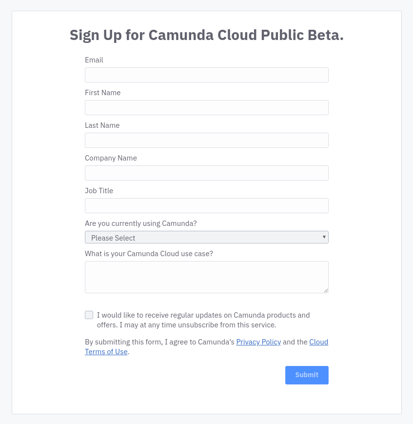
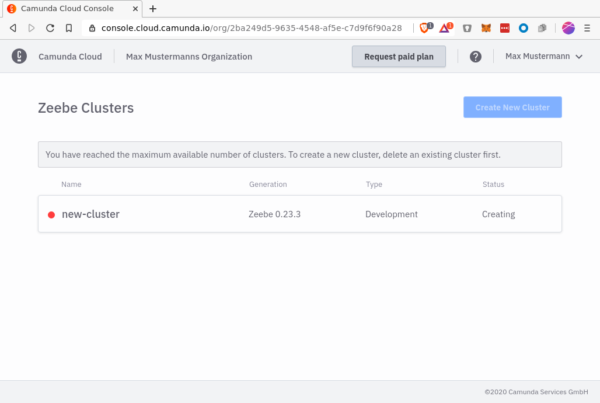
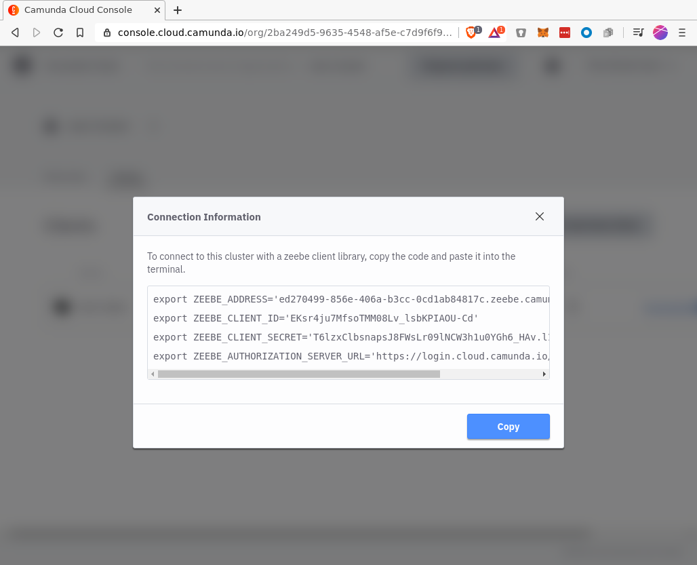
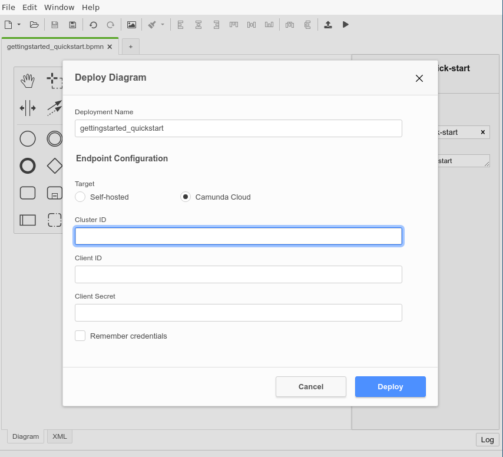
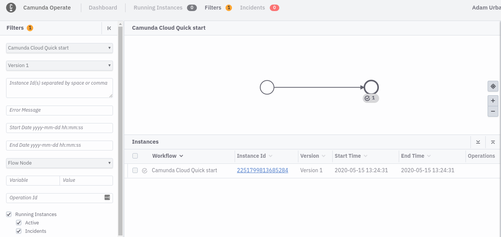

This section helps you get up and running in minutes with your first Camunda Cloud Cluster using Zeebe Modeler!

These steps will get you started:

1. Sign up for Camunda Cloud
2. Install Zeebe Modeler
3. Login to your Camunda Cloud account
4. Create a cluster
5. Create a client
6. Deploy your first workflow
7. Start a new instance

## Sign up for Camunda Cloud

Create a Camunda Cloud account for yourself, so that you can create clusters, deploy workflows and create a new instance.

### Visit [https://accounts.cloud.camunda.io/signup](https://accounts.cloud.camunda.io/signup)

The **Sign Up** screen appears:

### Fill in the form and submit

After you've filled in and sent the form, you'll receive a confirmation e-mail. Click on the link to verify your e-mail address and set your password.

## Install Zeebe Modeler

The Zeebe Modeler is a desktop application for modeling Zeebe Workflows with BPMN. Download the [latest release](https://github.com/zeebe-io/zeebe-modeler/releases) and start the application.

## Login to your Camunda Cloud account

### Visit [https://camunda.io](https://camunda.io)

Log in with your e-mail address and password:

## Create a cluster

After login you'll see the console overview page. Since you haven't created a cluster, the overview will be empty.

In the upper right area you'll find the button *Create New Cluster*. Click on it to create a new cluster. After you've assigned a name and created the cluster, a new entry appears in the overview:

The cluster is now being set up. During this phase, its state is *Creating*. After one or two minutes the cluster is ready for use and changes its state to *healthy*:

## Create a client

To create a new client you have to jump to the detail view. Click on the created cluster. In the lower area you will find the Client section:

Click on *Create new client* to create a new client, name your client accordingly:

In the next step you'll see all information you need to connect:

* `ZEEBE_ADDRESS`: Address where your cluster can be reached.
* `ZEEBE_CLIENT_ID` and `ZEEBE_CLIENT_SECRET`: Credentials to request a new access token.
* `ZEEBE_AUTHORIZATION_SERVER_URL`: A new token can be requested at this address, using the credentials.

## Deploy your first workflow

Using the Zeebe Modeler, workflows can be deployed and new instances created.

Download the [BPMN model](assets/gettingstarted_quickstart.bpmn) and open it with the Zeebe Modeler.

It's the simplest model with one start and one end event.

On the right side of the navigation menu there are buttons for deploying and starting workflows.

In the deployment dialog, the connection information must now be specified: ClusterId, ClientId and ClientSecret. Click Deploy to deploy the workflow now. Use the Play button from the navigation to start a new instance.

Now switch back to the cluster detail view of Camunda Cloud Console. Right after the cluster information you will find a link called *View Workflow Instances in Camunda Operate*. Click on this link to jump to Operate. You will now see the Operate Dashboard. The available workflows are listed in the lower left area. You have deployed the workflow *Camunda Cloud Quick start*!

Click on the deployed workflow to view all instances of it:

In the upper area you will find the graphical representation of your workflow. In the lower area you can see all instances.

Congratulations, you have deployed a first workflow and started an instance. In the [advanced Quick Start](./gettingstarted_quick-start-advanced.md) you will learn how to register and use your own worker.
